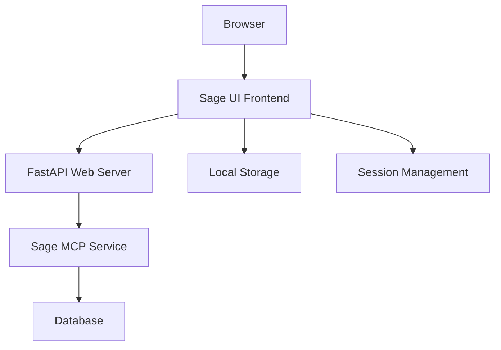

# Design Document

## Overview

The Sage UI is a simple, clean web application that provides a human-friendly interface for developers and app builders to manage their API keys, access grants, and usage logs through the Sage backend system. Built as a single-page application (SPA), it focuses on essential functionality while maintaining a layout that can accommodate future features like analytics and alerts without requiring a complete redesign.

## Architecture

### High-Level Architecture



**Component Flow:**
1. Human user (developer/app builder) accesses Sage UI in browser
2. UI communicates with existing FastAPI web server endpoints
3. FastAPI server calls the existing Sage MCP service methods
4. User session and preferences stored in browser local storage

### Frontend Architecture

**Technology Stack:**
- **HTML5** - Semantic markup structure
- **CSS3** - Styling with CSS Grid/Flexbox for layout
- **Vanilla JavaScript** - No framework dependencies for MVP simplicity
- **Fetch API** - HTTP requests to backend
- **Local Storage** - Session persistence and user preferences

**Component Structure:**
```
sage_ui/
├── index.html          # Main application shell
├── css/
│   ├── main.css        # Core styles and layout
│   └── components.css  # Component-specific styles
├── js/
│   ├── app.js          # Main application logic
│   ├── api.js          # Backend API communication
│   ├── components.js   # UI component functions
│   └── utils.js        # Utility functions
└── assets/
    └── icons/          # SVG icons for UI elements
```

## Components and Interfaces

### 1. Main Application Shell

**Layout Structure:**
```html
<div class="app-container">
  <header class="app-header">
    <h1>Sage API Key Manager</h1>
    <div class="user-info"><!-- Developer/user session info --></div>
  </header>
  
  <nav class="app-nav">
    <button class="nav-item active" data-view="keys">Keys</button>
    <button class="nav-item" data-view="grants">Grants</button>
    <button class="nav-item" data-view="logs">Logs</button>
    <!-- Reserved space for future Analytics/Alerts tabs -->
  </nav>
  
  <main class="app-main">
    <div id="keys-view" class="view active"><!-- Keys content --></div>
    <div id="grants-view" class="view"><!-- Grants content --></div>
    <div id="logs-view" class="view"><!-- Logs content --></div>
  </main>
  
  <div class="notifications"><!-- Success/error messages --></div>
</div>
```

### 2. Keys Management View

**Key List Component:**
```html
<div class="keys-section">
  <div class="section-header">
    <h2>API Keys</h2>
    <button class="btn-primary" onclick="showAddKeyForm()">Add Key</button>
  </div>
  
  <div class="keys-list">
    <!-- Key items populated by JavaScript -->
  </div>
</div>

<!-- Add Key Modal -->
<div class="modal" id="add-key-modal">
  <form class="modal-content">
    <h3>Add New API Key</h3>
    <input type="text" name="key_name" placeholder="Key Name" required>
    <select name="environment" required>
      <option value="">Select Environment</option>
      <option value="staging">Staging</option>
      <option value="prod">Production</option>
    </select>
    <textarea name="api_key" placeholder="API Key" required></textarea>
    <div class="modal-actions">
      <button type="button" onclick="closeModal()">Cancel</button>
      <button type="submit">Add Key</button>
    </div>
  </form>
</div>
```

**Key Item Structure:**
```javascript
const keyItemTemplate = {
  key_id: "string",
  key_name: "string", 
  environment: "staging|prod",
  created_at: "datetime",
  is_active: "boolean",
  grant_count: "number" // Number of active grants
};
```

### 3. Grants Management View

**Grants List Component:**
```html
<div class="grants-section">
  <div class="section-header">
    <h2>Access Grants</h2>
    <select id="key-filter" onchange="filterGrants()">
      <option value="">All Keys</option>
      <!-- Populated with user's keys -->
    </select>
  </div>
  
  <div class="grants-list">
    <!-- Grant items populated by JavaScript -->
  </div>
</div>

<!-- Add Grant Modal -->
<div class="modal" id="add-grant-modal">
  <form class="modal-content">
    <h3>Create Access Grant</h3>
    <select name="key_id" required>
      <option value="">Select Key</option>
      <!-- Populated with user's keys -->
    </select>
    <input type="text" name="caller_agent_id" placeholder="Agent/App ID that will use this key" required>
    <input type="number" name="max_calls_per_day" placeholder="Max Calls Per Day" required>
    <input type="date" name="expiry_date" required>
    <div class="modal-actions">
      <button type="button" onclick="closeModal()">Cancel</button>
      <button type="submit">Create Grant</button>
    </div>
  </form>
</div>
```

**Grant Item Structure:**
```javascript
const grantItemTemplate = {
  grant_id: "string",
  key_id: "string",
  key_name: "string", // For display
  caller_id: "string",
  max_calls_per_day: "number",
  current_usage: "number",
  expires_at: "datetime",
  is_active: "boolean"
};
```

### 4. Usage Logs View

**Logs Display Component:**
```html
<div class="logs-section">
  <div class="section-header">
    <h2>Usage Logs</h2>
    <div class="logs-filters">
      <select id="key-filter-logs">
        <option value="">All Keys</option>
        <!-- Populated with user's keys -->
      </select>
      <select id="time-filter">
        <option value="24h">Last 24 Hours</option>
        <option value="7d">Last 7 Days</option>
      </select>
    </div>
  </div>
  
  <div class="logs-table">
    <table>
      <thead>
        <tr>
          <th>Timestamp</th>
          <th>Agent/App ID</th>
          <th>Key</th>
          <th>Endpoint</th>
          <th>Status</th>
          <th>Response Time</th>
        </tr>
      </thead>
      <tbody id="logs-tbody">
        <!-- Log entries populated by JavaScript -->
      </tbody>
    </table>
  </div>
  
  <div class="logs-empty" style="display: none;">
    <p>No usage logs found for the selected filters.</p>
  </div>
</div>
```

**Log Entry Structure:**
```javascript
const logEntryTemplate = {
  timestamp: "datetime",
  caller_id: "string",
  key_name: "string", // For display
  endpoint: "string",
  response_code: "number",
  response_time: "number" // milliseconds
};
```

## Data Models

### Frontend Data Models

**Key Model:**
```javascript
class Key {
  constructor(data) {
    this.key_id = data.key_id;
    this.key_name = data.key_name;
    this.environment = data.environment;
    this.created_at = new Date(data.created_at);
    this.is_active = data.is_active;
    this.grant_count = data.grant_count || 0;
  }
  
  getDisplayName() {
    return `${this.key_name} (${this.environment})`;
  }
  
  getStatusBadge() {
    return this.is_active ? 'active' : 'inactive';
  }
}
```

**Grant Model:**
```javascript
class Grant {
  constructor(data) {
    this.grant_id = data.grant_id;
    this.key_id = data.key_id;
    this.key_name = data.key_name;
    this.caller_id = data.caller_id;
    this.max_calls_per_day = data.max_calls_per_day;
    this.current_usage = data.current_usage || 0;
    this.expires_at = new Date(data.expires_at);
    this.is_active = data.is_active;
  }
  
  getRemainingCalls() {
    return Math.max(0, this.max_calls_per_day - this.current_usage);
  }
  
  getUsagePercentage() {
    return Math.round((this.current_usage / this.max_calls_per_day) * 100);
  }
  
  isExpiringSoon() {
    const oneDayFromNow = new Date(Date.now() + 24 * 60 * 60 * 1000);
    return this.expires_at <= oneDayFromNow;
  }
}
```

### API Interface

**FastAPI Endpoints Integration:**
```javascript
const API_BASE = '/api/v1';

const API_ENDPOINTS = {
  // Keys - Maps to existing SageMCP.add_key() and KeyManager methods
  listKeys: () => `${API_BASE}/keys`,
  addKey: () => `${API_BASE}/keys`,
  deleteKey: (keyId) => `${API_BASE}/keys/${keyId}`,
  
  // Grants - Maps to existing SageMCP.grant_access() and AuthorizationEngine methods
  listGrants: (keyId = null) => keyId ? `${API_BASE}/grants?key_id=${keyId}` : `${API_BASE}/grants`,
  createGrant: () => `${API_BASE}/grants`,
  revokeGrant: (grantId) => `${API_BASE}/grants/${grantId}`,
  
  // Logs - Maps to existing SageMCP.list_logs() method
  getLogs: (keyId = null, timeFilter = '24h') => {
    const params = new URLSearchParams();
    if (keyId) params.append('key_id', keyId);
    params.append('time_filter', timeFilter);
    return `${API_BASE}/logs?${params}`;
  }
};
```

**FastAPI Endpoint Implementation Notes:**
The FastAPI server will expose REST endpoints that directly call the existing Sage MCP service methods:
- `POST /api/v1/keys` → `sage_mcp.add_key()`
- `GET /api/v1/keys` → `key_manager.list_keys()`
- `POST /api/v1/grants` → `sage_mcp.grant_access()`
- `GET /api/v1/logs` → `sage_mcp.list_logs()`

**API Client:**
```javascript
class SageAPI {
  async request(endpoint, options = {}) {
    const response = await fetch(endpoint, {
      headers: {
        'Content-Type': 'application/json',
        ...options.headers
      },
      ...options
    });
    
    if (!response.ok) {
      throw new Error(`API Error: ${response.status} ${response.statusText}`);
    }
    
    return response.json();
  }
  
  // Key operations
  async listKeys() {
    return this.request(API_ENDPOINTS.listKeys());
  }
  
  async addKey(keyData) {
    return this.request(API_ENDPOINTS.addKey(), {
      method: 'POST',
      body: JSON.stringify(keyData)
    });
  }
  
  async deleteKey(keyId) {
    return this.request(API_ENDPOINTS.deleteKey(keyId), {
      method: 'DELETE'
    });
  }
  
  // Grant operations
  async listGrants(keyId = null) {
    return this.request(API_ENDPOINTS.listGrants(keyId));
  }
  
  async createGrant(grantData) {
    return this.request(API_ENDPOINTS.createGrant(), {
      method: 'POST',
      body: JSON.stringify(grantData)
    });
  }
  
  async revokeGrant(grantId) {
    return this.request(API_ENDPOINTS.revokeGrant(grantId), {
      method: 'DELETE'
    });
  }
  
  // Log operations
  async getLogs(keyId = null, timeFilter = '24h') {
    return this.request(API_ENDPOINTS.getLogs(keyId, timeFilter));
  }
}
```

## Error Handling

### Error Display Strategy

**Error Types:**
1. **Network Errors** - Connection issues, timeouts
2. **Validation Errors** - Form input validation failures
3. **API Errors** - Backend service errors
4. **Authentication Errors** - Session expired, unauthorized access

**Error Display Components:**
```javascript
class NotificationManager {
  show(message, type = 'info', duration = 5000) {
    const notification = document.createElement('div');
    notification.className = `notification notification-${type}`;
    notification.innerHTML = `
      <span class="notification-message">${message}</span>
      <button class="notification-close" onclick="this.parentElement.remove()">×</button>
    `;
    
    document.querySelector('.notifications').appendChild(notification);
    
    if (duration > 0) {
      setTimeout(() => notification.remove(), duration);
    }
  }
  
  showError(message) {
    this.show(message, 'error');
  }
  
  showSuccess(message) {
    this.show(message, 'success', 3000);
  }
}
```

### Form Validation

**Client-side Validation:**
```javascript
class FormValidator {
  validateKeyForm(formData) {
    const errors = [];
    
    if (!formData.key_name.trim()) {
      errors.push('Key name is required');
    }
    
    if (!formData.environment) {
      errors.push('Environment selection is required');
    }
    
    if (!formData.api_key.trim()) {
      errors.push('API key is required');
    }
    
    return errors;
  }
  
  validateGrantForm(formData) {
    const errors = [];
    
    if (!formData.key_id) {
      errors.push('Key selection is required');
    }
    
    if (!formData.caller_agent_id.trim()) {
      errors.push('Agent/App ID is required');
    }
    
    if (!formData.max_calls_per_day || formData.max_calls_per_day < 1) {
      errors.push('Max calls per day must be at least 1');
    }
    
    if (!formData.expiry_date) {
      errors.push('Expiry date is required');
    } else if (new Date(formData.expiry_date) <= new Date()) {
      errors.push('Expiry date must be in the future');
    }
    
    return errors;
  }
}
```

## Testing Strategy

### Manual Testing Scenarios

**Key Management Testing:**
1. Add new key with valid data → Success notification and key appears in list
2. Add key with missing fields → Validation errors displayed
3. Delete key → Confirmation dialog → Key removed from list
4. View key list → Keys display with correct environment badges

**Grant Management Testing:**
1. Create grant with valid data → Success notification and grant appears
2. Create grant with invalid expiry → Validation error
3. Revoke grant → Confirmation → Grant status updated
4. Filter grants by key → Only relevant grants shown

**Logs Testing:**
1. View logs with time filter → Correct logs displayed
2. Filter by key → Only logs for selected key shown
3. No logs available → "No usage yet" message displayed
4. Logs loading → Loading indicator shown

### Browser Compatibility Testing

**Target Browsers:**
- Chrome 90+
- Firefox 88+
- Safari 14+
- Edge 90+

**Testing Checklist:**
- [ ] All forms submit correctly
- [ ] Modals open and close properly
- [ ] Navigation between views works
- [ ] Responsive layout on different screen sizes
- [ ] Error messages display correctly
- [ ] Loading states function properly

## Security Considerations

### Frontend Security

**Data Protection:**
- Never store API keys in browser storage
- Clear sensitive form data after submission
- Use HTTPS for all API communications
- Implement proper session timeout handling

**Input Sanitization:**
```javascript
class SecurityUtils {
  sanitizeInput(input) {
    return input.replace(/[<>\"']/g, '');
  }
  
  validateAgentId(agentId) {
    // Basic validation for agent/app ID format
    return /^[a-zA-Z0-9_-]+$/.test(agentId);
  }
}
```

**Session Management:**
```javascript
class SessionManager {
  isSessionValid() {
    const sessionData = localStorage.getItem('sage_session');
    if (!sessionData) return false;
    
    const session = JSON.parse(sessionData);
    return session.expires > Date.now();
  }
  
  clearSession() {
    localStorage.removeItem('sage_session');
    window.location.href = '/login';
  }
}
```

## Future Extensibility

### Layout Considerations

The design reserves space for future features:

**Navigation Extension:**
- Analytics tab can be added to existing nav structure
- Alerts/Notifications tab space reserved
- Settings/Profile section can be added to header

**Dashboard Expansion:**
- Main content area designed with CSS Grid for easy layout changes
- Component-based structure allows adding new views
- API client designed to easily add new endpoints

**Planned Future Features:**
1. **Analytics Dashboard** - Usage charts and statistics
2. **Real-time Alerts** - Push notifications for important events
3. **Bulk Operations** - Multi-select for keys and grants
4. **Advanced Filtering** - More sophisticated log filtering options
5. **Export Functionality** - CSV/JSON export for logs and analytics