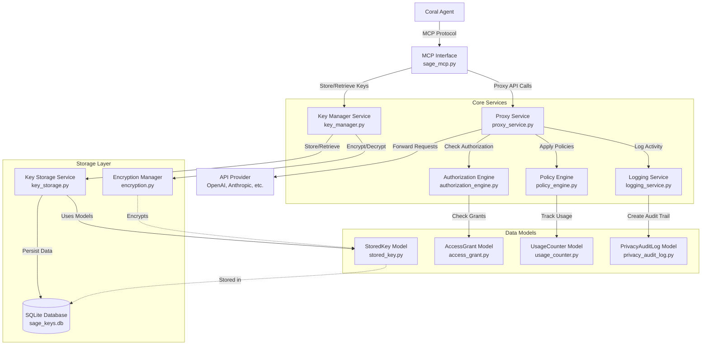
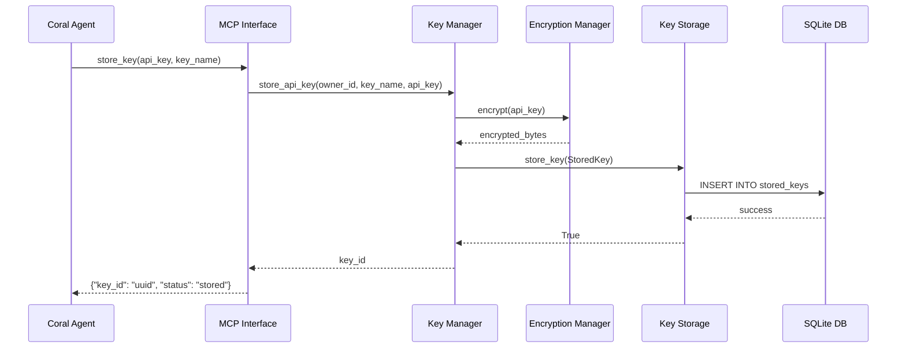
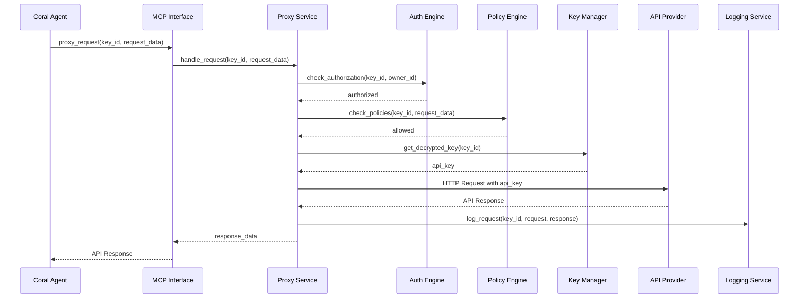
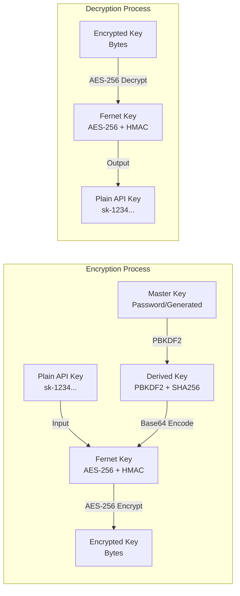
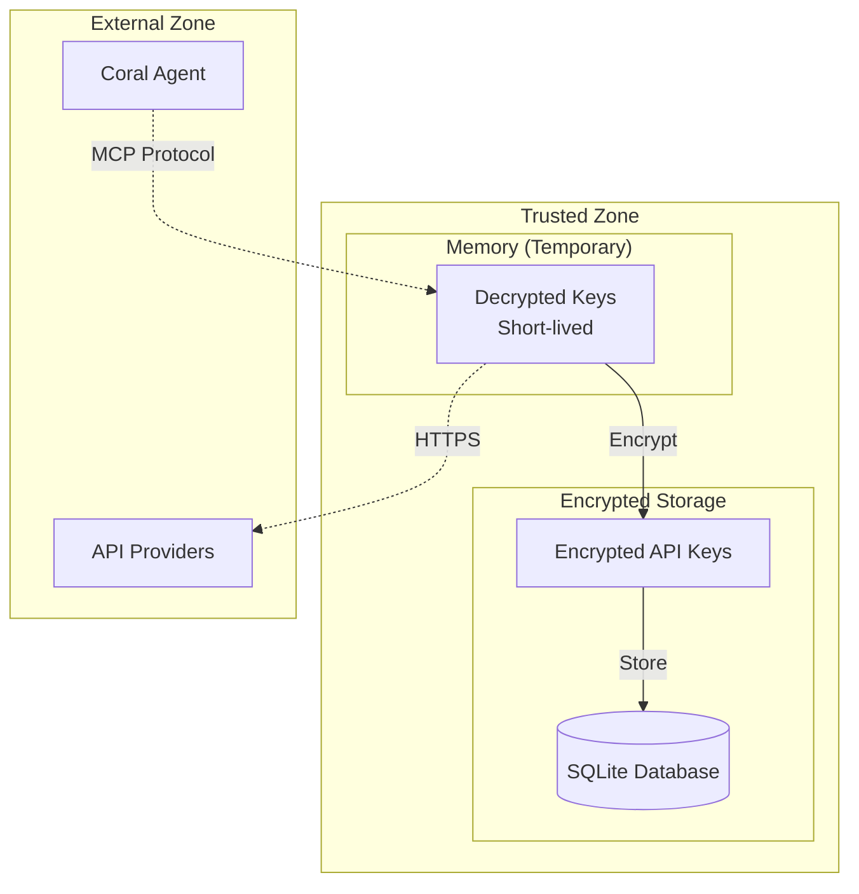

# Sage Architecture Flowchart

This document shows how all the entities and functions in the Sage system interact with each other.

## System Architecture Overview

## Detailed Component Interactions

### 1. Key Storage Flow

### 2. API Proxy Flow

### 3. Encryption/Decryption Flow

## Component Responsibilities

### Models Layer
- **StoredKey**: Represents encrypted API keys with metadata
- **AccessGrant**: Defines access permissions and scopes
- **UsageCounter**: Tracks API usage and rate limits
- **PrivacyAuditLog**: Records all access and operations for compliance

### Services Layer
- **KeyManager**: High-level key management operations
- **KeyStorage**: Low-level database operations for key persistence
- **ProxyService**: Handles API request proxying and response processing
- **AuthorizationEngine**: Validates access permissions
- **PolicyEngine**: Enforces usage policies and rate limits
- **LoggingService**: Creates audit trails and compliance logs

### Utils Layer
- **EncryptionManager**: Handles AES-256 encryption/decryption
- **Validation Functions**: API key format validation

### Interface Layer
- **MCP Interface**: Exposes functionality via Model Context Protocol
- **sage_mcp.py**: Main MCP server implementation

## Data Flow Summary

1. **Key Storage**: Coral Agent → MCP → KeyManager → EncryptionManager → KeyStorage → SQLite
2. **Key Retrieval**: SQLite → KeyStorage → KeyManager → EncryptionManager → MCP → Coral Agent
3. **API Proxying**: Coral Agent → MCP → ProxyService → (Auth/Policy checks) → API Provider → Response logging
4. **Audit Trail**: All operations → LoggingService → PrivacyAuditLog → SQLite

## Security Boundaries

The system maintains security by:
- Encrypting all API keys at rest using AES-256
- Keeping decrypted keys in memory only during active requests
- Using secure key derivation (PBKDF2) for master keys
- Implementing comprehensive audit logging
- Enforcing authorization and policy checks before key access